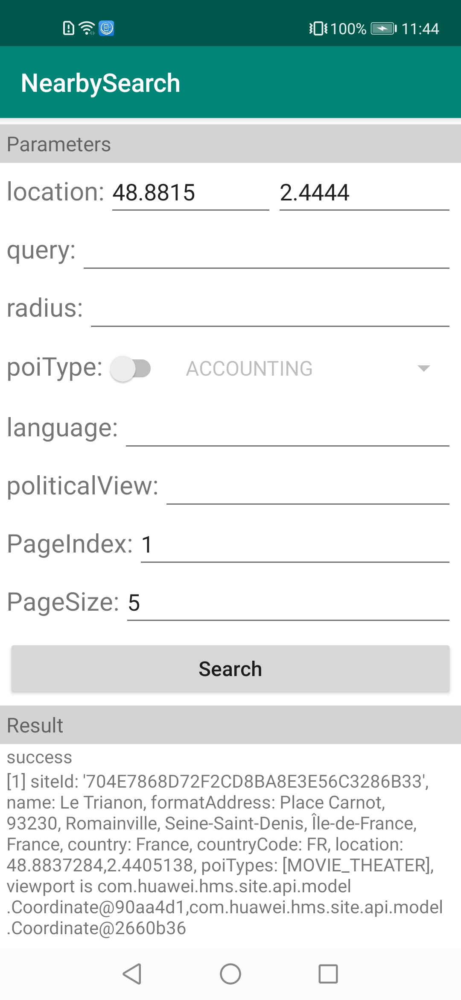

安卓版华为位置服务示例代码
===============================

中文 | [English](https://github.com/HMS-Core/hms-sitekit-demo/blob/master/README.md)

## 目录

 * [简介](#简介)
* [开发准备](#开发准备)
* [环境要求](#环境要求)
* [支撑](#支撑)
* [结果](#结果)
* [授权许可](#授权许可)

简介
------------

通过华为位置服务，你的应用可以让用户方便安全的使用各种位置相关的服务。

华为位置服务通过提供如下核心能力，帮助你快速构建基于位置服务的产品，满足用户对探索周边地点的需求：

- 关键字搜索：通过用户输入的关键字，返回地点列表。
- 周边搜索：基于用户设备位置进行地点查找。
- 地点详情：查询某个地点更详细的信息。
- 地点搜索建议：返回一个地点列表，从而实现地点预测功能。
- Widget：内置地点搜索建议功能的搜索组件。
- 自动补全：根据输入的关键字返回预测的输入关键字和地点查询建议。

该示例也可以通过HMS Toolkit快速启动运行，且支持各Kit一站式集成，并提供远程真机免费调测等功能。了解更多信息，请参考HMS Toolkit官方链接：https://developer.huawei.com/consumer/cn/doc/development/Tools-Guides/getting-started-0000001077381096

开发准备
---------------
我们提供一个示例展示如何使用安卓版华为位置服务SDK。

该示例使用Gradle编译系统。

首先通过克隆该仓库或者下载压缩包的方式来下载示例代码。

在Android Stuido中，选择Open an existing Android Studio project，然后选择site-sample文件所在的目录。

你可以使用gradlew build命令来直接编译项目。

你应该在AppGallery Connect中创建一个应用，获取agconnect-services.json文件并将其加入到你的项目中。你还应生成一个签名证书指纹，将证书文件添加到你的项目中，并在build.gradle文件中添加配置。参见“[配置AppGallery Connect](https://developer.huawei.com/consumer/cn/doc/development/HMSCore-Guides/android-sdk-config-agc-0000001050158579)”在AppGallery Connect配置应用信息。同时，需要把Utils.java或者Utils.kt中getApiKey函数的apiKey变量的值（"your api key"），更改为从agconnect-services.json中获取到的apiKey的值。

更多开发详情，请参见如下链接：

- [开发指南](https://developer.huawei.com/consumer/cn/doc/development/HMSCore-Guides/android-sdk-introduction-0000001050158571)
- [接口参考](https://developer.huawei.com/consumer/cn/doc/development/HMSCore-References/package-summary-0000001064775040)

环境要求
-------

推荐Android SDK版本号为19或以上，JDK版本号为1.8或以上。

支撑
-------

如果你在使用过程中有任何问题或建议，欢迎访问如下链接给出你的建议或与我们交流：https://github.com/HMS-Core/hms-sitekit-demo/issues

## 结果

## 技术支持
如果您对HMS Core还处于评估阶段，可在[Reddit社区](https://www.reddit.com/r/HuaweiDevelopers/)获取关于HMS Core的最新讯息，并与其他开发者交流见解。

如果您对使用HMS示例代码有疑问，请尝试：
- 开发过程遇到问题上[Stack Overflow](https://stackoverflow.com/questions/tagged/huawei-mobile-services)，在`huawei-mobile-services`标签下提问，有华为研发专家在线一对一解决您的问题。
- 到[华为开发者论坛](https://developer.huawei.com/consumer/cn/forum/blockdisplay?fid=18) HMS Core板块与其他开发者进行交流。

如果您在尝试示例代码中遇到问题，请向仓库提交[issue](https://github.com/HMS-Core/hms-nearby-demo/issues)，也欢迎您提交[Pull Request](https://github.com/HMS-Core/hms-nearby-demo/pulls)。

授权许可
-------
Apache License 2.0

你可以访问如下链接获取授权许可副本：https://github.com/HMS-Core/hms-sitekit-demo/blob/master/LICENSE

